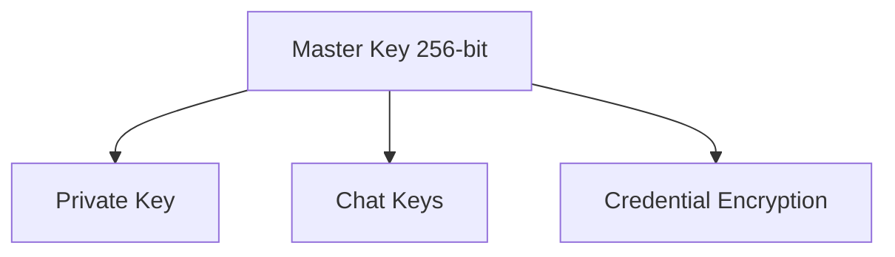

# Fumadocs Documentation Setup

## Overview

Create a new Fumadocs documentation app at `apps/docs` within your monorepo, configured with Mermaid diagram support and populated with your E2EE Architecture whitepaper content.

## Step 1: Create Fumadocs App

Run the Fumadocs CLI to scaffold the app:

```bash
cd apps && bun create fumadocs-app docs
```

Select options:

- Framework: **Next.js**
- Content source: **Fumadocs MDX**

## Step 2: Integrate with Monorepo

Update the new `apps/docs/package.json`:

- Change the name to `@onera/docs`
- Ensure compatibility with existing Bun/Turborepo setup

Add scripts to root [`package.json`](package.json):

```json
"dev:docs": "turbo run dev --filter=@onera/docs",
"build:docs": "turbo run build --filter=@onera/docs"
```

## Step 3: Configure Mermaid Support

Install the Mermaid rehype plugin:

```bash
cd apps/docs && bun add rehype-mermaid playwright
```

Update the MDX configuration in `apps/docs/source.config.ts` to add the rehype-mermaid plugin.

## Step 4: Documentation Structure

Create the following structure in `apps/docs/content/docs/`:

```
content/docs/
  index.mdx              # Introduction
  whitepaper/
    index.mdx            # Abstract & TOC
    threat-model.mdx     # Section 2
    cryptographic-primitives.mdx  # Section 3
    key-hierarchy.mdx    # Section 4
    key-derivation.mdx   # Section 5
    key-sharding.mdx     # Section 6
    encryption-flows.mdx # Section 7
    session-management.mdx # Section 8
    recovery.mdx         # Section 9
    multi-device.mdx     # Section 10
    webauthn.mdx         # Section 11
    server-architecture.mdx # Section 12
    security-analysis.mdx # Section 13
    comparison.mdx       # Section 14
    conclusion.mdx       # Section 15
    references.mdx       # Section 16
  meta.json              # Navigation configuration
```

## Step 5: Convert Whitepaper to MDX

Convert the ASCII diagrams in the whitepaper to Mermaid syntax. Example conversion:

**Original ASCII:**

```
┌─────────────────┐
│  Master Key     │
└─────────────────┘
        │
        ▼
┌─────────────────┐
│  Private Key    │
└─────────────────┘
```

**Mermaid equivalent:**



## Key Files to Modify

- [`package.json`](package.json) - Add docs scripts
- [`turbo.json`](turbo.json) - Turborepo already configured for builds
- `apps/docs/source.config.ts` - MDX config with Mermaid
- `apps/docs/content/docs/` - Documentation content