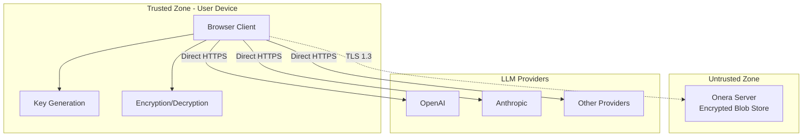

# Welcome to Onera

Onera is a privacy-focused AI chat application that implements true end-to-end encryption (E2EE) for all user data.

## What is Onera?

Onera ensures that sensitive information—including chat messages, API credentials, and personal notes—remains encrypted at rest and in transit, with decryption possible only on authorized user devices.

## Key Features

- **Zero-Knowledge Server**: The server operates exclusively as an encrypted blob store
- **End-to-End Encryption**: All sensitive data encrypted client-side before transmission
- **Direct LLM Access**: API calls go directly to providers, bypassing Onera servers
- **Multiple Recovery Options**: Password, passkey, and recovery phrase authentication

## Architecture Overview

## Documentation

<Cards>
  <Card title="E2EE Whitepaper" href="/docs/whitepaper" description="Detailed technical documentation of Onera's cryptographic architecture" />
</Cards>

## Security Guarantees

| Guarantee | Description |
|-----------|-------------|
| **Confidentiality** | Only authorized users can read plaintext data |
| **Integrity** | Tampering with encrypted data is detectable |
| **Forward Secrecy** | Past sessions remain secure if keys are compromised |
| **Recovery** | Users can regain access without central authority |

## Get Started

Explore the [E2EE Architecture Whitepaper](/docs/whitepaper) to understand how Onera protects your data.
