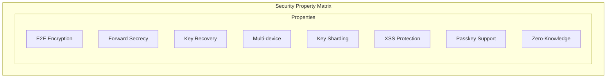

# Comparison with Industry Standards

## Signal Protocol

| Aspect | Signal | Onera |
|--------|--------|-------|
| **Use Case** | Messaging | AI chat + credentials |
| **Key Exchange** | X3DH + Double Ratchet | X25519 sealed boxes |
| **Forward Secrecy** | Per-message (ratchet) | Per-chat key |
| **Key Recovery** | None (by design) | BIP39 recovery phrase |
| **Multi-device** | Linked devices | Independent device shares |

**Key Difference:** Signal prioritizes forward secrecy via ratcheting; Onera prioritizes recoverability while maintaining strong encryption.

## Ente

| Aspect | Ente | Onera |
|--------|------|-------|
| **Use Case** | Photo storage | AI chat |
| **Recovery** | 24-word phrase | 24-word phrase (same approach) |
| **Key Sharding** | Not documented | 3-share XOR |
| **Session Security** | Standard | Non-extractable Web Crypto |

**Inspiration:** Onera's recovery mechanism is modeled after Ente's approach.

## Bitwarden

| Aspect | Bitwarden | Onera |
|--------|-----------|-------|
| **Use Case** | Password manager | AI chat |
| **KDF** | PBKDF2/Argon2id | Argon2id (always) |
| **Key Derivation** | Master password only | Password + device + recovery |
| **Server Trust** | Encrypted vault | Encrypted + sharded keys |

**Key Difference:** Onera's 3-share system provides additional protection beyond password-derived encryption.

## ProtonMail

| Aspect | ProtonMail | Onera |
|--------|------------|-------|
| **Use Case** | Email | AI chat |
| **Encryption** | OpenPGP | libsodium |
| **Key Storage** | Encrypted on server | Sharded across systems |
| **Recovery** | Recovery phrase | Recovery phrase |

**Key Difference:** ProtonMail stores encrypted private keys on server; Onera distributes shares.

## Summary Comparison Matrix

| Property | Signal | Ente | Bitwarden | Onera |
|----------|--------|------|-----------|-------|
| E2E Encryption | ✓ | ✓ | ✓ | ✓ |
| Forward Secrecy | ✓✓ | - | - | ✓ |
| Key Recovery | ✗ | ✓ | ✓ | ✓ |
| Multi-device | ✓ | ✓ | ✓ | ✓ |
| Key Sharding | - | - | - | ✓ |
| XSS Protection | N/A | - | - | ✓ |
| Passkey Support | - | - | ✓ | ✓ |
| Zero-Knowledge | ✓ | ✓ | ✓ | ✓ |

**Legend:** ✓ = supported, ✓✓ = exceptional, - = not applicable/limited, ✗ = not supported

## Key Differentiators

### What Sets Onera Apart

1. **3-Share Key Sharding**
   - No single point of failure
   - Requires compromise of multiple independent systems

2. **Non-Extractable Session Keys**
   - Web Crypto API protection against XSS
   - Keys cannot be exported even with code execution

3. **Direct LLM API Access**
   - API calls bypass Onera servers
   - Zero visibility into user conversations

4. **WebAuthn PRF Integration**
   - Hardware-bound authentication
   - No password required for daily use
