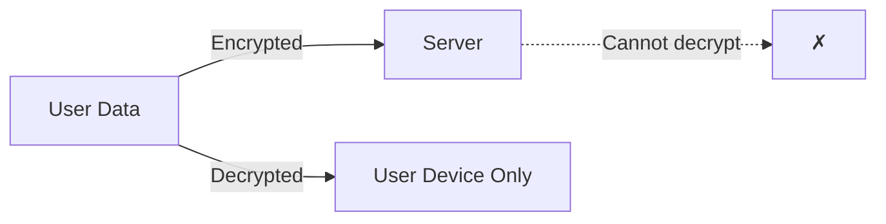
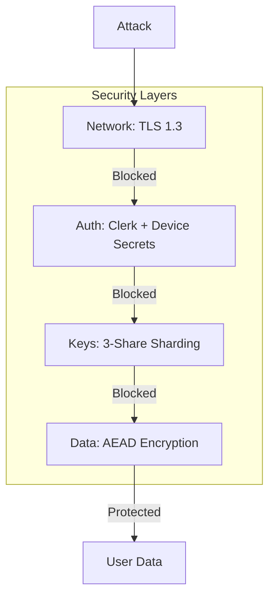
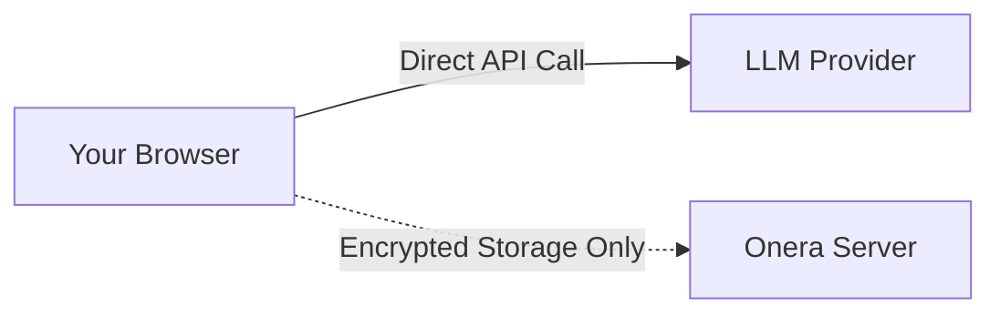

# Conclusion

Onera's end-to-end encryption architecture provides strong security guarantees for AI chat applications:

## Security Guarantees

### 1. True Zero-Knowledge

The server operates exclusively as an encrypted blob store with no ability to access plaintext user data, even under compulsion.

### 2. Defense in Depth

Multiple independent security layers—3-share key sharding, memory-hard KDFs, non-extractable session keys, and per-chat encryption—ensure that compromising any single component is insufficient to breach user privacy.

### 3. Usability Without Compromise

Password, passkey, and recovery phrase authentication options provide flexibility without weakening the security model.

| Method | Security | Convenience |
|--------|----------|-------------|
| Password | High (Argon2id) | Medium |
| Passkey | Very High (Hardware-bound) | High |
| Recovery Phrase | High | Emergency only |

### 4. Transparent Design

This architecture is open for independent security review and audit.

- Source code available at `/packages/crypto/`
- All algorithms are industry-standard and well-audited
- No proprietary or custom cryptographic constructions

### 5. Direct LLM Access

By routing LLM API calls directly from client to provider, Onera eliminates itself as a potential point of data interception.

## Summary

| Guarantee | Implementation |
|-----------|----------------|
| **Confidentiality** | XSalsa20-Poly1305 AEAD, per-chat keys |
| **Integrity** | Poly1305 MAC, authenticated encryption |
| **Forward Secrecy** | Per-chat keys, sealed box ephemeral keys |
| **Recovery** | BIP39 mnemonic, encrypted backup |
| **Multi-Device** | Device shares, re-sharding |
| **Zero-Knowledge** | Server stores only encrypted blobs |

## Contact

We welcome security researchers to review this architecture and report any findings.

**Security Contact:** security@onera.ai
