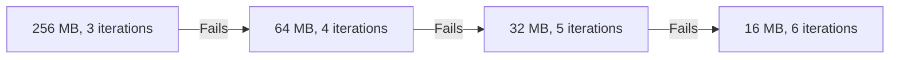

# Cryptographic Primitives

All cryptographic operations use **libsodium** (v0.7.16), a modern, audited cryptographic library.

## Symmetric Encryption

**Algorithm:** XSalsa20-Poly1305 (`crypto_secretbox`)

| Parameter | Value |
|-----------|-------|
| Cipher | XSalsa20 (stream cipher) |
| Authentication | Poly1305 MAC |
| Key Size | 256 bits |
| Nonce Size | 192 bits |
| MAC Size | 128 bits |

### Selection Rationale

- **Nonce-misuse resistance**: 192-bit nonces make collisions astronomically unlikely
- **Authenticated encryption**: Prevents tampering
- **Constant-time implementation**: Prevents timing attacks
- **Well-audited**: Widely deployed in Signal, WireGuard, etc.

## Asymmetric Encryption

**Algorithm:** X25519 + XSalsa20-Poly1305 (`crypto_box_seal`)

| Parameter | Value |
|-----------|-------|
| Key Exchange | X25519 (Curve25519 ECDH) |
| Encryption | XSalsa20-Poly1305 |
| Public Key Size | 256 bits |
| Private Key Size | 256 bits |

### Selection Rationale

- **Ephemeral key in sealed box**: Provides forward secrecy
- **No sender identity leakage**: Anonymous encryption
- **Industry standard**: Used in modern E2EE systems

## Password-Based Key Derivation

**Algorithm:** Argon2id

| Parameter | Default Value |
|-----------|---------------|
| Algorithm | Argon2id (hybrid) |
| Memory | 256 MB |
| Iterations | 3 (MODERATE) |
| Parallelism | 1 |
| Salt Size | 128 bits |
| Output Size | 256 bits |

### Fallback Chain

For low-memory devices, Onera uses a fallback chain:

### Selection Rationale

- **Memory-hard**: Resists GPU/ASIC brute-force attacks
- **Hybrid mode**: Combines data-dependent and data-independent passes
- **Winner**: Password Hashing Competition (2015)
- **Adaptive fallback**: Maintains security on constrained devices

## Hashing and Key Derivation

| Function | Algorithm | Use Case |
|----------|-----------|----------|
| General Hashing | BLAKE2b | Device key derivation, verification IDs |
| KDF | libsodium `crypto_kdf` | Deriving subkeys from master key |
| PRF KDF | HKDF-SHA256 | WebAuthn PRF to KEK derivation |

## Random Number Generation

All randomness uses libsodium's `randombytes_buf()`, which:

- Uses OS-provided CSPRNG (`/dev/urandom`, `CryptGenRandom`)
- Is seeded from hardware entropy sources
- Passes all standard randomness tests
