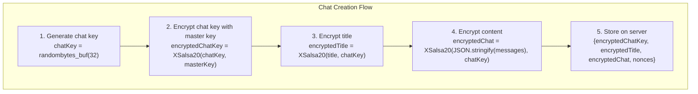
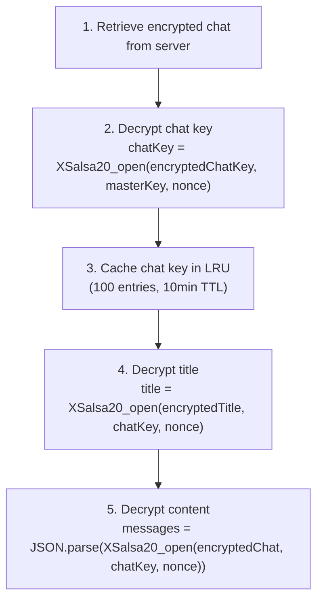
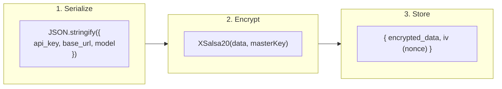
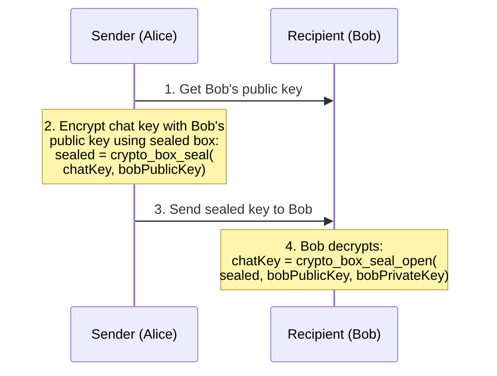

# Encryption Flows

## Chat Encryption

Each chat has its own symmetric key for content isolation.

### Creating a New Chat



### Decrypting a Chat



## Chat Key Caching

To avoid repeated decryption, chat keys are cached in memory:

```typescript
SecureLRUCache<chatId, chatKey> {
  maxSize: 100,
  ttl: 10 * 60 * 1000,  // 10 minutes
  onEvict: (key) => sodium.memzero(key)
}
```

## Credential Encryption

LLM API credentials are encrypted directly with the master key:



## Notes Encryption

Notes follow the same pattern as credentials:

```typescript
encryptedTitle = XSalsa20(title, masterKey)
encryptedContent = XSalsa20(content, masterKey)
```

## Chat Sharing (Key Exchange)

When sharing a chat with another user:



### Public Key Verification

Users can verify each other's public keys using a 12-word verification phrase:

```typescript
verificationId = SHA256(publicKey)[0:16]  // First 128 bits
verificationPhrase = BIP39.encode(verificationId)  // 12 words
```
