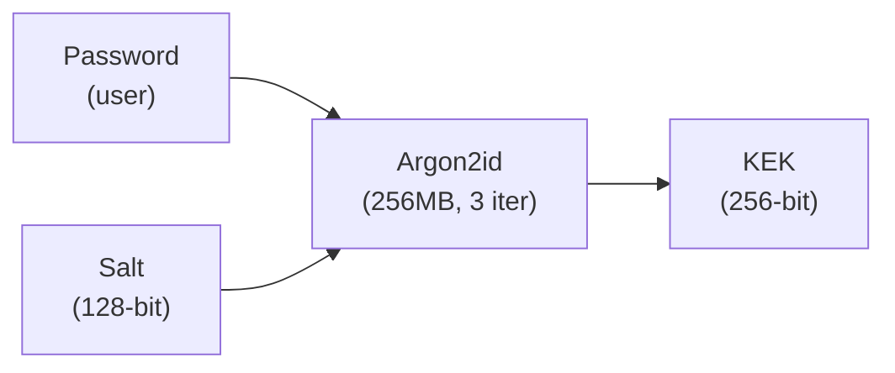
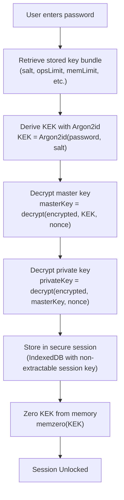

# Key Derivation and Protection

## Password to Key Encryption Key (KEK)

When a user sets up their account or unlocks with a password:



### Process

1. Generate random 128-bit salt (stored with encrypted key)
2. Derive KEK: `KEK = Argon2id(password, salt, memory=256MB, ops=3)`
3. Encrypt master key: `encrypted = XSalsa20(masterKey, KEK)`
4. Securely zero KEK from memory
5. Store: `{salt, opsLimit, memLimit, encryptedMasterKey, nonce}`

## Stored Key Bundle

The storable key bundle contains all information needed to unlock:

```typescript
interface StorableUserKeys {
  // Password encryption parameters
  kekSalt: string;           // Base64 Argon2id salt
  kekOpsLimit: number;       // Argon2id iterations
  kekMemLimit: number;       // Argon2id memory (bytes)

  // Encrypted keys
  encryptedMasterKey: string;    // XSalsa20(masterKey, KEK)
  masterKeyNonce: string;        // Nonce for above
  encryptedPrivateKey: string;   // XSalsa20(privateKey, masterKey)
  privateKeyNonce: string;       // Nonce for above
  encryptedRecoveryKey: string;  // XSalsa20(recoveryKey, masterKey)
  recoveryKeyNonce: string;      // Nonce for above

  // Recovery mechanism
  masterKeyRecovery: string;     // XSalsa20(masterKey, recoveryKey)
  masterKeyRecoveryNonce: string;

  // Public information
  publicKey: string;             // Plaintext, for sharing
}
```

## Unlock Flow



## Memory Safety

All sensitive key material is:

1. **Allocated** using libsodium's secure memory functions
2. **Zeroed** immediately after use with `sodium.memzero()`
3. **Never logged** or serialized to disk in plaintext
4. **Cleared** on session lock or page unload

```typescript
// Example: Secure key handling
async function unlockWithPassword(password: string) {
  const kek = await deriveKEK(password, salt, opsLimit, memLimit);
  
  try {
    const masterKey = await decrypt(encryptedMasterKey, kek, nonce);
    await storeInSecureSession(masterKey);
  } finally {
    // Always zero sensitive material
    sodium.memzero(kek);
  }
}
```
