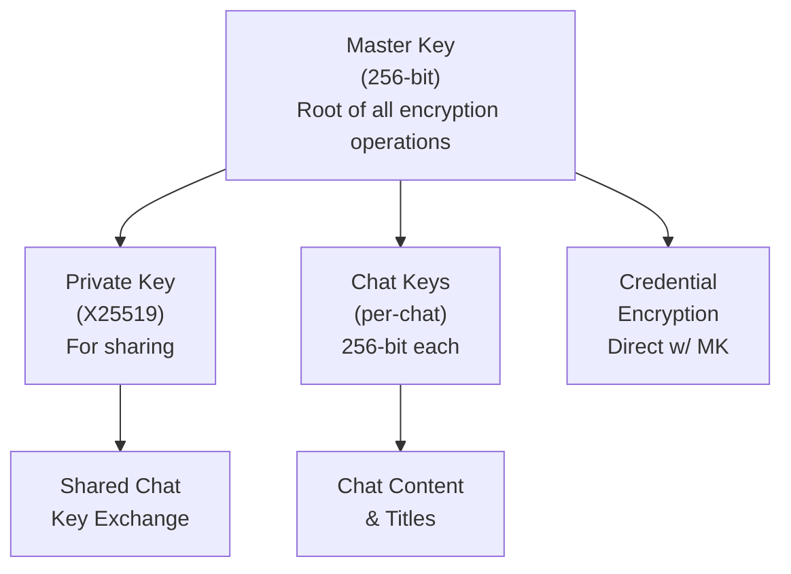
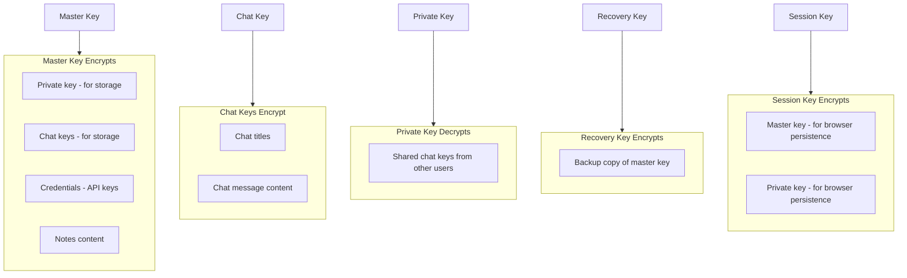

# Key Hierarchy

Onera uses a hierarchical key structure where a single master key protects all user data.

## Key Types Overview

## Key Descriptions

| Key | Size | Generation | Purpose |
|-----|------|------------|---------|
| **Master Key** | 256-bit | `randombytes_buf(32)` | Root key for all encryption |
| **Private Key** | 256-bit | `crypto_box_keypair()` | Asymmetric decryption, chat sharing |
| **Public Key** | 256-bit | `crypto_box_keypair()` | Asymmetric encryption, identity |
| **Recovery Key** | 256-bit | `randombytes_buf(32)` | Account recovery via BIP39 mnemonic |
| **Chat Key** | 256-bit | `randombytes_buf(32)` | Per-chat symmetric encryption |
| **Session Key** | 256-bit | `crypto.subtle.generateKey()` | Browser session (non-extractable) |

## Key Relationships

### Relationship Summary

1. **Master Key** encrypts:
   - Private key (for storage)
   - Chat keys (for storage)
   - Credentials (API keys)
   - Notes content

2. **Chat Keys** encrypt:
   - Chat titles
   - Chat message content

3. **Private Key** decrypts:
   - Shared chat keys from other users

4. **Recovery Key** encrypts:
   - Backup copy of master key (for recovery)

5. **Session Key** encrypts:
   - Master key (for browser session persistence)
   - Private key (for browser session persistence)
