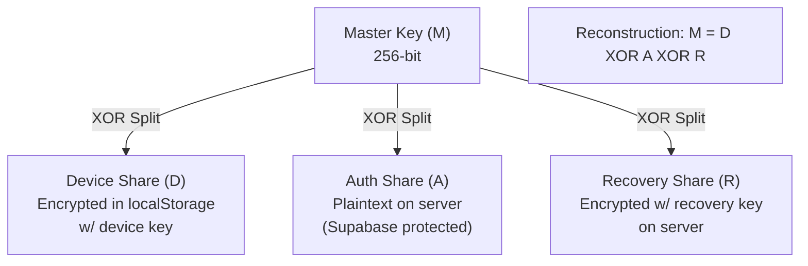
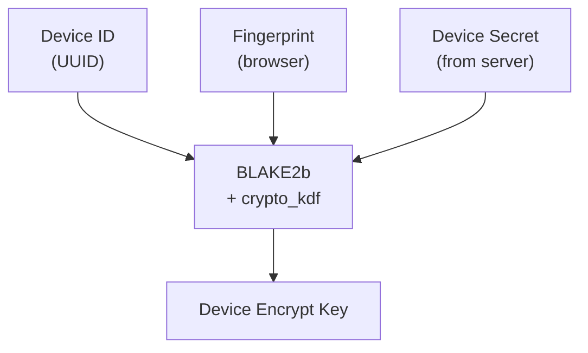

# Key Sharding System

Onera implements a 3-share XOR-based key sharding system, requiring compromise of multiple independent systems to reconstruct the master key.

## Sharding Architecture



## Share Generation

```typescript
function splitMasterKey(masterKey: Uint8Array): Shares {
  // Generate two random shares
  const deviceShare = randombytes_buf(32);
  const authShare = randombytes_buf(32);

  // Calculate third share such that XOR equals master key
  const recoveryShare = new Uint8Array(32);
  for (let i = 0; i < 32; i++) {
    recoveryShare[i] = masterKey[i] ^ deviceShare[i] ^ authShare[i];
  }

  return { deviceShare, authShare, recoveryShare };
}
```

## Share Storage

| Share | Storage Location | Protection |
|-------|------------------|------------|
| **Device Share** | Browser localStorage | Encrypted with device-specific key derived from: `BLAKE2b(deviceId + fingerprint + serverDeviceSecret)` |
| **Auth Share** | Server database | Plaintext, protected by Supabase authentication |
| **Recovery Share** | Server database | Encrypted with user's recovery key |

## Device Share Protection

The device share is encrypted with a key derived from multiple sources:



**Security:** Even with full localStorage access (XSS), an attacker cannot decrypt the device share without the server-side device secret.

## Attack Surface Analysis

| Components Compromised | Can Reconstruct? | Notes |
|------------------------|------------------|-------|
| Server only | No | Has auth share + encrypted recovery share, missing device share |
| Device only | No | Has encrypted device share, missing auth share |
| Server + Device | Still No | Recovery share encrypted; needs recovery key |
| Server + Device + Recovery Phrase | **Yes** | Full compromise allows reconstruction |

## Why Not Shamir Secret Sharing?

XOR-based splitting was chosen over Shamir Secret Sharing because:

| Property | XOR (Onera) | Shamir |
|----------|-------------|--------|
| Threshold | All shares required | k-of-n configurable |
| Implementation | Trivial | Polynomial arithmetic |
| Error detection | None built-in | Threshold provides redundancy |
| Attack surface | Single equation | More complex reconstruction |
| Audit simplicity | Trivial verification | Requires crypto expertise |

### Rationale

1. **Simpler implementation:** Less room for cryptographic errors
2. **No threshold ambiguity:** Requires ALL shares (no 2-of-3 weakness)
3. **Performance:** Single XOR vs polynomial evaluation
4. **Auditability:** Trivial to verify correctness

The tradeoff is losing k-of-n flexibility, but Onera's design intentionally requires all three systems for reconstruction.
