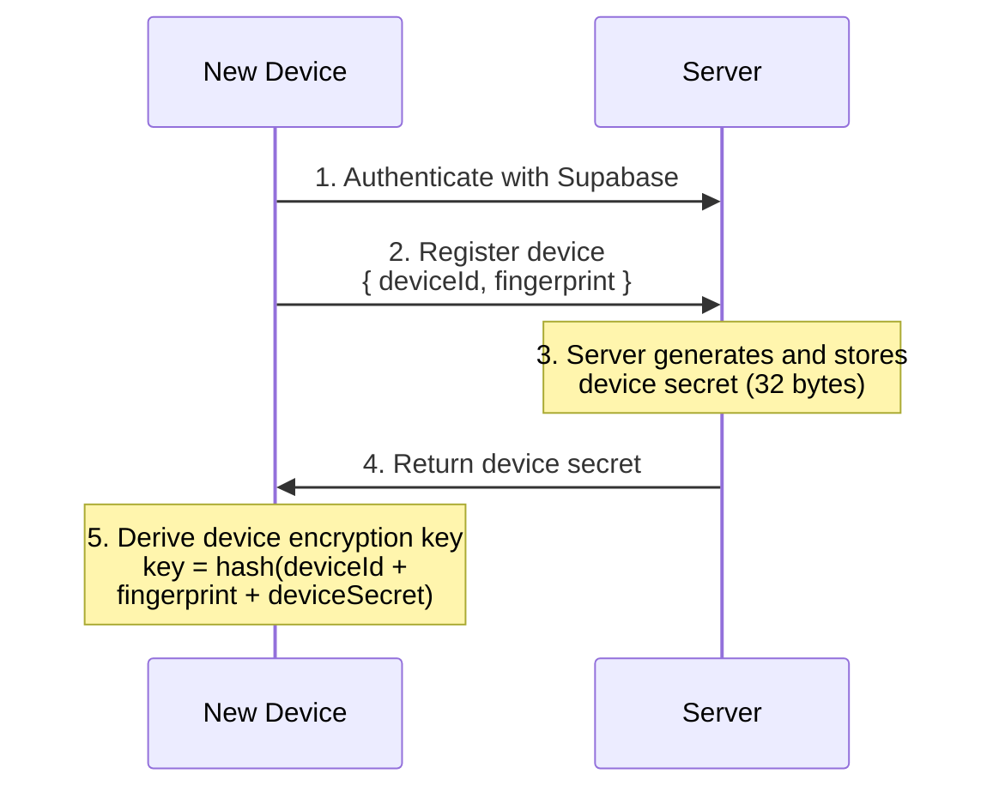
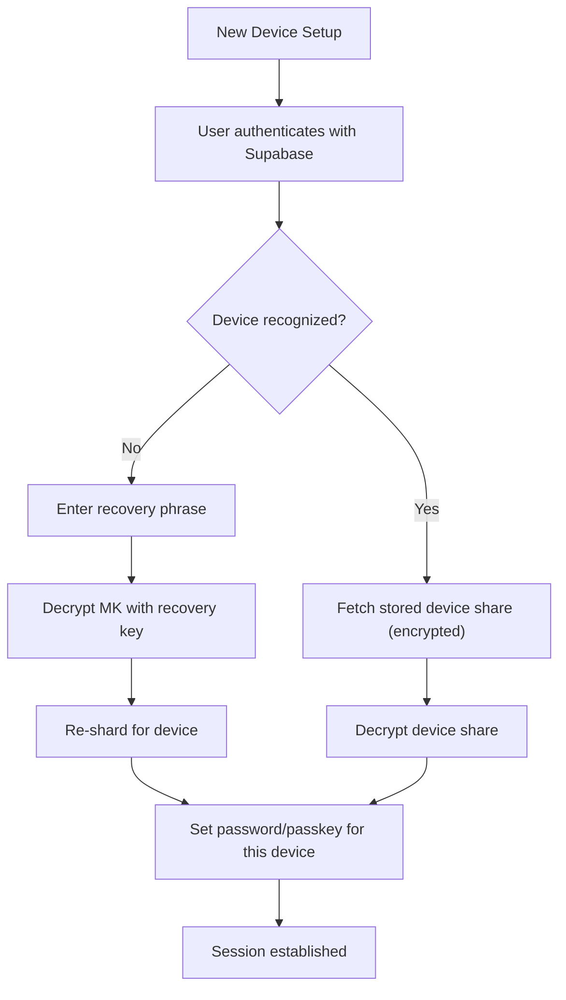
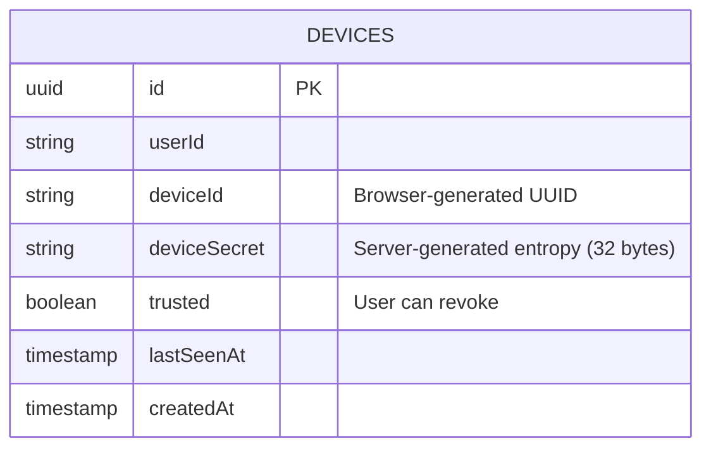
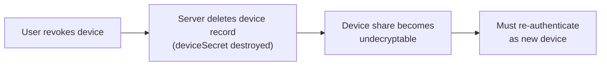

# Multi-Device Support

## Device Registration

When a user signs in on a new device:



## Re-sharding for New Device

When adding a new device, the key shares must be regenerated:

```typescript
function reshardForNewDevice(
  masterKey: Uint8Array,
  existingAuthShare: Uint8Array
): NewShares {
  // Generate new random device share
  const newDeviceShare = randombytes_buf(32);

  // Calculate new recovery share to maintain:
  // M = D' XOR A XOR R'
  const newRecoveryShare = new Uint8Array(32);
  for (let i = 0; i < 32; i++) {
    newRecoveryShare[i] = masterKey[i] ^
                          newDeviceShare[i] ^
                          existingAuthShare[i];
  }

  return {
    deviceShare: newDeviceShare,
    recoveryShare: newRecoveryShare,
    // Auth share remains unchanged
  };
}
```

## New Device Setup Flow



## Device Management



### Database Schema

```sql
CREATE TABLE devices (
  id UUID PRIMARY KEY,
  user_id TEXT NOT NULL,
  device_id TEXT NOT NULL,         -- Browser UUID
  device_secret TEXT NOT NULL,     -- Server-generated entropy
  trusted BOOLEAN DEFAULT false,
  last_seen_at TIMESTAMP,
  created_at TIMESTAMP
);
```

## Device Revocation

When a device is revoked:

1. **Server deletes device record** (deviceSecret destroyed)
2. **Device share on that device becomes undecryptable**
3. **User must re-authenticate** on that device as new device


