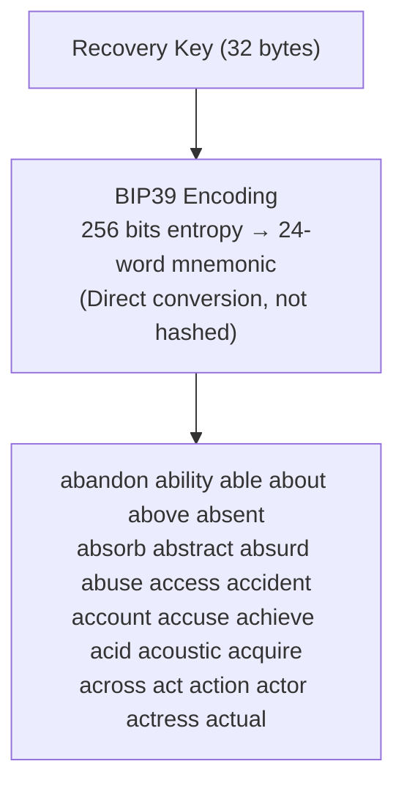
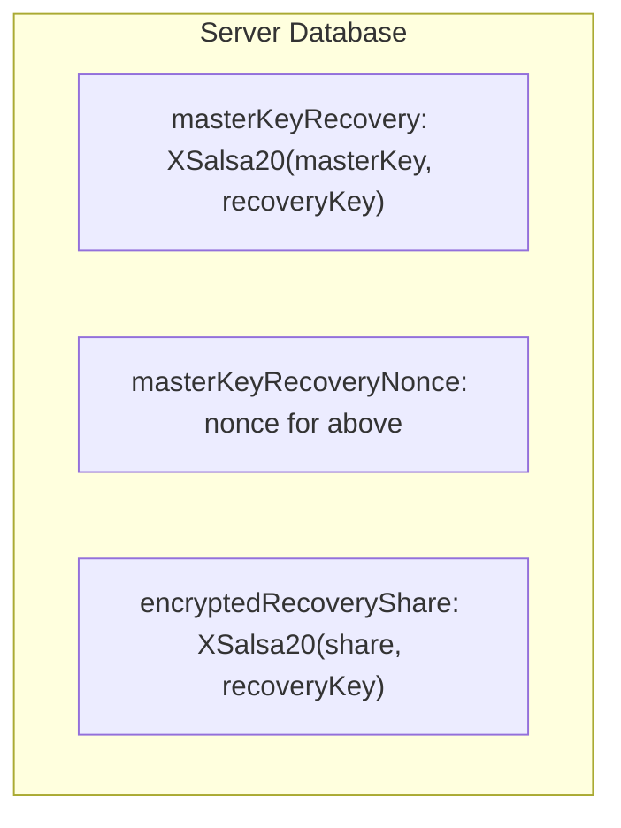
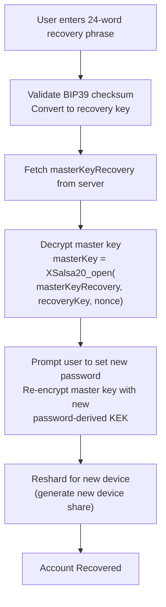

# Recovery Mechanisms

## Recovery Key and BIP39 Mnemonic

During account setup, a 256-bit recovery key is generated and encoded as a 24-word BIP39 mnemonic:



### Why Direct Conversion?

- **Reversible:** mnemonic ↔ key (essential for recovery)
- **Previous hash-based approaches** made recovery impossible
- **BIP39 checksum** provides error detection

## Recovery Data Storage



## Recovery Flow



## Multiple Unlock Paths

| Method | Key Derivation | Use Case |
|--------|---------------|----------|
| **Password** | Argon2id → KEK | Daily use |
| **Passkey** | WebAuthn PRF → HKDF → KEK | Passwordless, biometric |
| **Recovery Phrase** | BIP39 → recovery key | Account recovery |

## Security Considerations

<Callout type="warn">
**Important Security Notes:**

1. **Recovery phrase is shown once:** Users must save it during setup
2. **Recovery phrase decrypts everything:** Treat as equivalent to master key
3. **No server-side recovery:** Onera cannot recover accounts
4. **Checksum validation:** BIP39 detects transcription errors
</Callout>

## Implementation Example

```typescript
async function recoverWithPhrase(phrase: string): Promise<void> {
  // Validate BIP39 checksum
  if (!bip39.validateMnemonic(phrase)) {
    throw new Error('Invalid recovery phrase');
  }
  
  // Convert mnemonic to recovery key (direct, not hashed)
  const recoveryKey = bip39.mnemonicToEntropy(phrase);
  
  // Fetch encrypted master key from server
  const { masterKeyRecovery, nonce } = await fetchRecoveryData();
  
  // Decrypt master key
  const masterKey = await decrypt(masterKeyRecovery, recoveryKey, nonce);
  
  // Prompt for new password and re-encrypt
  const newPassword = await promptNewPassword();
  await setupNewPassword(masterKey, newPassword);
  
  // Generate new device share
  await reshardForNewDevice(masterKey);
}
```
