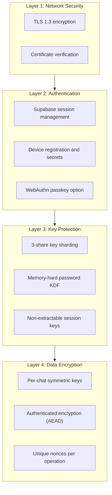

# Security Analysis

## Cryptographic Strength

| Component | Security Level | Notes |
|-----------|---------------|-------|
| Master Key | 256-bit | Exceeds 128-bit security target |
| XSalsa20-Poly1305 | 256-bit | AEAD with 192-bit nonces |
| X25519 | ~128-bit | Standard elliptic curve security |
| Argon2id | Memory-hard | 256MB default resists GPU attacks |
| BLAKE2b | 256-bit | Faster than SHA-256, equally secure |

## Attack Resistance Matrix

| Attack Vector | Mitigation | Effectiveness |
|---------------|------------|---------------|
| **Brute-force password** | Argon2id (256MB × 3 iterations) | ~1 attempt/second on high-end GPU |
| **Server database breach** | Master key not stored; shares distributed | Full breach insufficient for decryption |
| **XSS (cross-site scripting)** | Non-extractable session keys | Attacker cannot export keys |
| **MITM (man-in-the-middle)** | TLS 1.3 required | Connection integrity verified |
| **Replay attacks** | Unique nonces per encryption | Each ciphertext unique |
| **Offline attack on encrypted data** | AEAD authentication | Tampering detectable |
| **Device theft (locked)** | Session timeout, device key | Requires server secret |
| **Device theft (unlocked)** | Out of scope | Physical security responsibility |

## XOR Sharding vs Shamir Secret Sharing

| Property | XOR (Onera) | Shamir |
|----------|-------------|--------|
| Threshold | All shares required | k-of-n configurable |
| Implementation complexity | Trivial | Polynomial arithmetic |
| Error detection | None built-in | Threshold provides redundancy |
| Attack surface | Single equation | More complex reconstruction |
| Audit simplicity | Trivial verification | Requires crypto expertise |

**Our Choice:** XOR sharding because all-or-nothing security is appropriate when shares are stored in fundamentally different trust domains (device, server, user memory).

## Known Limitations

<Callout type="warn">
**Security Boundaries:**

1. **Physical device access while unlocked:** An attacker with physical access to an unlocked device can access decrypted data. *Mitigation: session timeouts.*

2. **Malicious browser extension:** Extensions with sufficient permissions could read page content. *Mitigation: users should audit installed extensions.*

3. **Compromised browser:** A compromised browser could be modified to exfiltrate keys. *Mitigation: keep browser updated.*

4. **Social engineering:** Users could be tricked into revealing recovery phrases. *Mitigation: user education.*

5. **Memory forensics:** Keys in RAM could theoretically be extracted. *Mitigation: libsodium secure memory; keys zeroed on lock.*
</Callout>

## Defense in Depth Summary

Each layer provides independent protection, ensuring that compromising a single layer does not expose user data.
