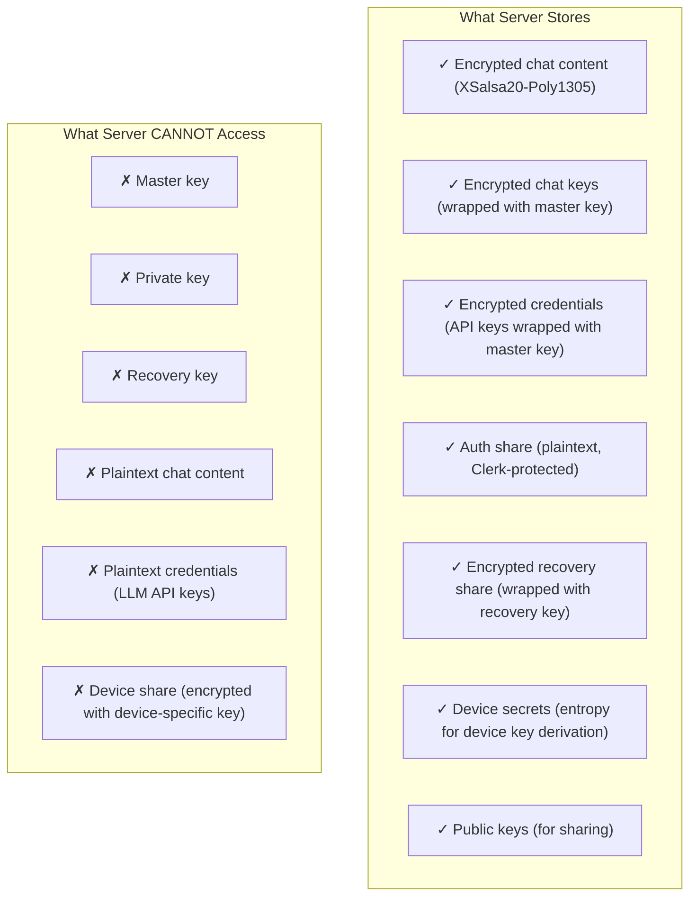
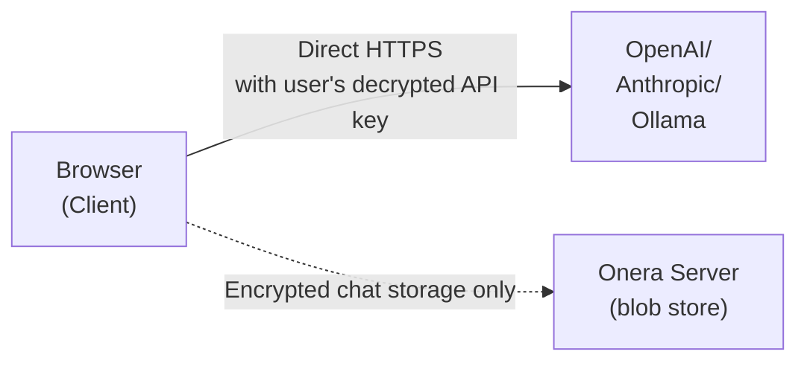

# Server Architecture

## Zero-Knowledge Design

The Onera server is designed as an encrypted blob store with no ability to decrypt user data:



## Database Schema

### Key Shares Table

```sql
CREATE TABLE key_shares (
  id UUID PRIMARY KEY,
  user_id TEXT NOT NULL,           -- Clerk user ID
  auth_share TEXT,                  -- Plaintext auth share
  encrypted_recovery_share TEXT,    -- Recovery-key encrypted
  public_key TEXT,                  -- Plaintext for sharing
  encrypted_private_key TEXT,       -- Master-key encrypted
  master_key_recovery TEXT,         -- Recovery-key encrypted
  master_key_recovery_nonce TEXT,
  -- Password encryption fields (SSO migration)
  encrypted_master_key TEXT,
  kek_salt TEXT,
  kek_ops_limit INTEGER,
  kek_mem_limit INTEGER
);
```

### Chats Table

```sql
CREATE TABLE chats (
  id UUID PRIMARY KEY,
  user_id TEXT NOT NULL,
  is_encrypted BOOLEAN DEFAULT true,
  encrypted_chat_key TEXT,          -- Master-key encrypted
  encrypted_title TEXT,             -- Chat-key encrypted
  encrypted_chat TEXT,              -- Chat-key encrypted
  title_nonce TEXT,
  chat_key_nonce TEXT,
  chat_nonce TEXT
);
```

### Devices Table

```sql
CREATE TABLE devices (
  id UUID PRIMARY KEY,
  user_id TEXT NOT NULL,
  device_id TEXT NOT NULL,         -- Browser UUID
  device_secret TEXT NOT NULL,     -- Server-generated entropy
  trusted BOOLEAN DEFAULT false,
  last_seen_at TIMESTAMP,
  created_at TIMESTAMP
);
```

## API Design

All tRPC endpoints require Clerk authentication:

```typescript
// Key shares
keyShares.get()              // Fetch auth share for authenticated user
keyShares.create()           // Store initial key bundle
keyShares.updateAuthShare()  // Update auth share on re-shard

// Devices
devices.register()           // Register new device, get secret
devices.getDeviceSecret()    // Fetch secret for known device

// WebAuthn
webauthn.getCredentials()    // List passkeys
webauthn.createCredential()  // Register new passkey
webauthn.deleteCredential()  // Revoke passkey

// Chats, Notes, Credentials
// All CRUD operations work with encrypted blobs
```

## LLM API Bypass

Onera never proxies LLM API calls:



### Benefits

- **Server never sees API keys** or conversation content
- **No additional latency** from server proxy
- **User maintains direct relationship** with LLM provider
