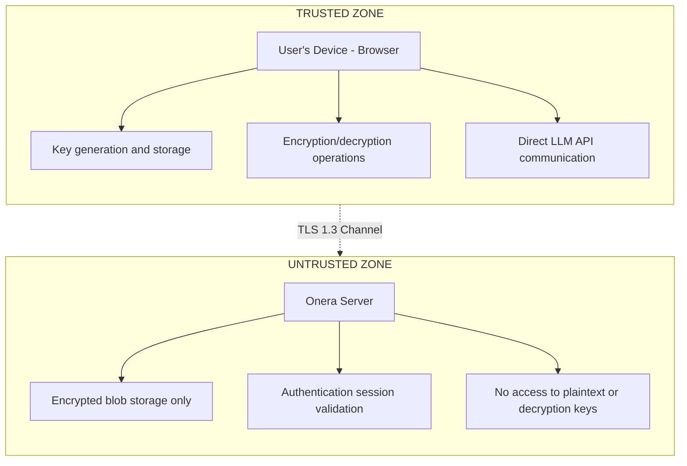

# Threat Model

## Adversary Capabilities

We consider adversaries with the following capabilities:

| Adversary Type | Capabilities |
|----------------|--------------|
| **Passive Network** | Intercept all network traffic |
| **Compromised Server** | Full read/write access to database and server code |
| **Compromised Auth Provider** | Access to Supabase authentication sessions |
| **Device Malware** | Read browser storage, inject JavaScript (XSS) |
| **Insider Threat** | Server administrator with database access |

## Security Goals

| Goal | Description |
|------|-------------|
| **Confidentiality** | Only authorized users can read plaintext data |
| **Integrity** | Tampering with encrypted data is detectable |
| **Forward Secrecy** | Past sessions remain secure if keys are compromised |
| **Recovery** | Users can regain access without central authority |

## Trust Boundaries

## Attack Scenarios and Mitigations

| Attack Scenario | Mitigation |
|-----------------|------------|
| Server database breach | Data encrypted; master key not stored on server |
| XSS attack on browser | Session keys are non-extractable via Web Crypto API |
| Password brute force | Argon2id with 256MB memory requirement |
| Man-in-the-middle | TLS 1.3 + certificate pinning |
| Device theft | Session timeout + device-bound keys |
| Insider server access | Zero-knowledge architecture; server cannot decrypt |

## Out of Scope

The following attack vectors are considered out of scope for this security model:

- Physical attacks on user devices with unlocked sessions
- Compromise of the user's password/recovery phrase
- Side-channel attacks on cryptographic implementations
- Attacks requiring compromise of all three sharding systems simultaneously
