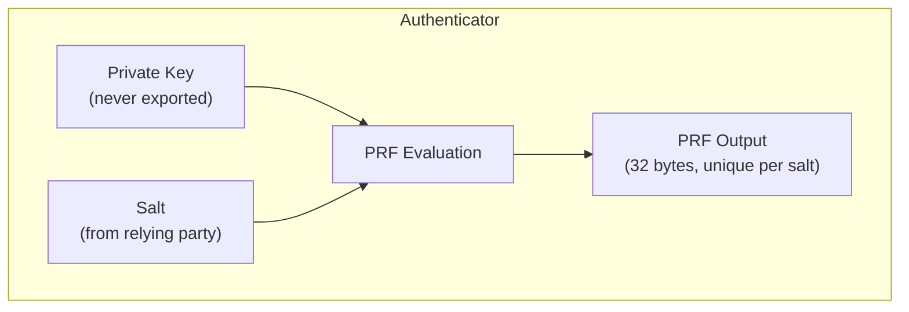
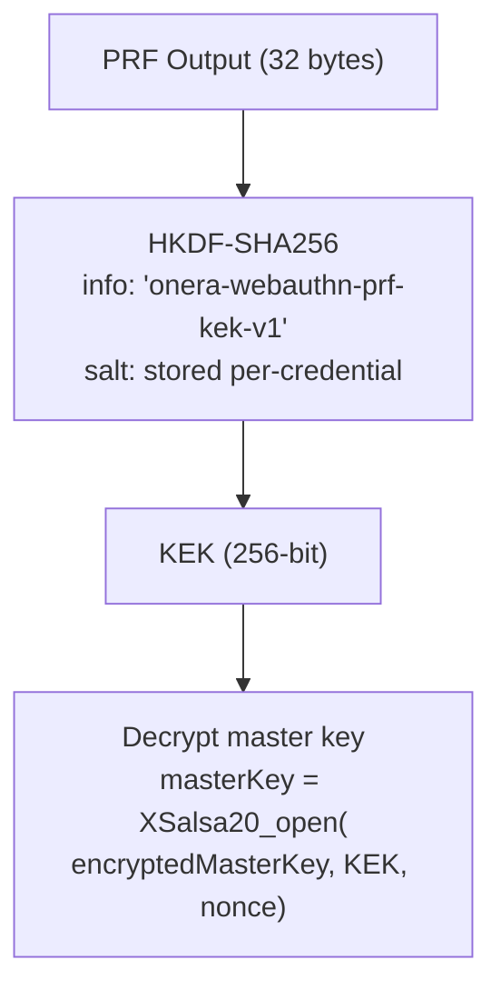
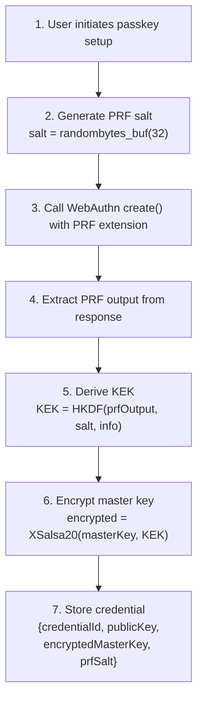
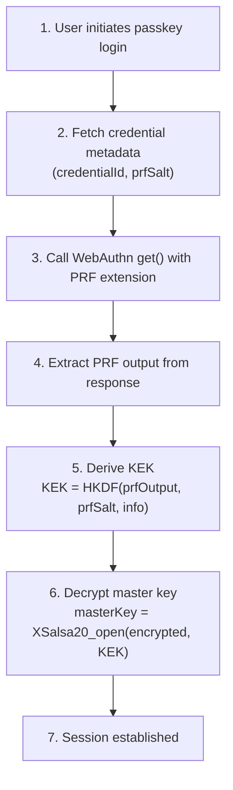
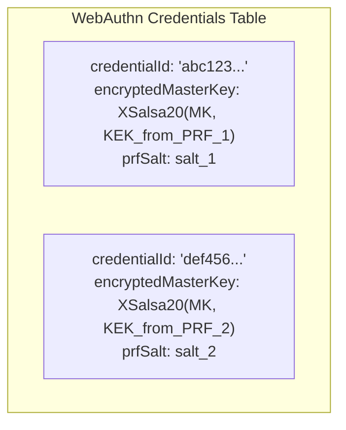

# WebAuthn/Passkey Integration

## PRF Extension Overview

WebAuthn's PRF (Pseudo-Random Function) extension enables device-bound key derivation:



### Key Properties

- **PRF output never leaves the authenticator** in extractable form
- **Different salt → different output** (allows key rotation)
- **Requires user verification** (biometric/PIN)
- **Bound to the authenticator hardware**

## PRF to KEK Derivation



## Passkey Registration Flow



### Registration Code

```typescript
credential = navigator.credentials.create({
  publicKey: {
    extensions: {
      prf: { eval: { first: salt } }
    }
  }
});
```

## Passkey Authentication Flow



## Multiple Passkeys

Each passkey has its own:
- Credential ID
- PRF salt
- Encrypted copy of master key



This allows **independent passkey revocation** without affecting others.

## PRF Support Detection

PRF support is detected heuristically (no direct API):

1. WebAuthn API available
2. Platform authenticator available
3. Conditional mediation supported
4. Verified during registration via `clientExtensionResults.prf.enabled`

```typescript
async function checkPRFSupport(): Promise<boolean> {
  // Check WebAuthn availability
  if (!window.PublicKeyCredential) return false;
  
  // Check platform authenticator
  const available = await PublicKeyCredential
    .isUserVerifyingPlatformAuthenticatorAvailable();
  if (!available) return false;
  
  // Check conditional mediation (modern passkey support)
  const conditional = await PublicKeyCredential
    .isConditionalMediationAvailable?.();
  
  return conditional ?? false;
}
```
